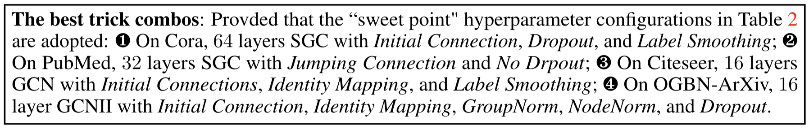

# Bag of Tricks for Training Deeper Graph Neural Networks: A Comprehensive Benchmark Study

[](https://opensource.org/licenses/MIT)

Codes for [Preprint] [Bag of Tricks for Training Deeper Graph Neural Networks: A Comprehensive Benchmark Study](https://arxiv.org/pdf/2108.10521.pdf)

Tianlong Chen\*, Kaixiong Zhou\*, Keyu Duan, Wenqing Zheng, Peihao Wang, Xia Hu, Zhangyang Wang

## Introduction

This is the first fair and reproducible benchmark dedicated to assessing the "tricks" of training deep GNNs. We categorize existing approaches, investigate their hyperparameter sensitivity, and unify the basic configuration. Comprehensive evaluations are then conducted on tens of representative graph datasets including the recent large-scale Open Graph Benchmark (OGB), with diverse deep GNN backbones. Based on synergistic studies, we discover the transferable combo of superior training tricks, that lead us to attain the new state-of-the-art results for deep GCNs, across multiple representative graph datasets.

## Requirements
#### Installation with Conda
```bash
conda create -n deep_gcn_benchmark
conda activate deep_gcn_benchmark
pip install -r requirement.txt
```

#### Our Installation Notes for PyTorch Geometric.

What env configs that we tried that have succeeded: Mac/Linux + cuda driver 11.2 + Torch with cuda 11.1 + torch_geometric/torch sparse/etc with cuda 11.1.

What env configs that we tried but didn't work: Linux+Cuda 11.1/11.0/10.2 + whatever version of Torch.

In the above case when it did work, we adopted the following installation commands, and it automatically downloaded built wheels, and the installation completes within seconds.

In the case when it did not work, the installation appears to be very slow (ten minutes level for torch sparse/torch scatter). Then the installation did not produce any error, while when import torch_geometric in python code, it reports errors of different types.

Installation codes that we adopted on Linux cuda 11.2 that did work:

```bash
pip3 install torch==1.9.0+cu111 torchvision==0.10.0+cu111 torchaudio==0.9.0 -f https://download.pytorch.org/whl/torch_stable.html
pip install torch-scatter -f https://pytorch-geometric.com/whl/torch-1.9.0+cu111.html
pip install torch-sparse -f https://pytorch-geometric.com/whl/torch-1.9.0+cu111.html
pip install torch-geometric
```

## Project Structure

```
.
├── Dataloader.py
├── main.py
├── trainer.py
├── models
│   ├── *.py
├── options
│   ├── base_options.py
│   └── configs
│       ├── *.yml
├── tricks
│   ├── tricks
│   │   ├── dropouts.py
│   │   ├── norms.py
│   │   ├── others.py
│   │   └── skipConnections.py
│   └── tricks_comb.py
└── utils.py
```

## How to Use the Benchmark

#### Train Deep GCN models as your baselines

To train a deep GCN model `<model>` on dataset `<dataset>` as your baseline, run:

```bash
python main.py --compare_model=1 --cuda_num=0 --type_model=<model> --dataset=<dataset>
# <model>   in  [APPNP, DAGNN, GAT, GCN, GCNII, GPRGNN, JKNet, SGC]
# <dataset> in  [Cora, Citeseer, Pubmed, ogbn-arixv, CoauthorCS, CoauthorPhysics, AmazonComputers, AmazonPhoto, TEXAS, WISCONSIN, CORNELL, ACTOR]
```

we comprehensively explored the optimal hyperparameters for all models we implemented and train the models under the
well-studied hyperparameter settings. For model-specific hyperparameter configs, please refer to `options/configs/*.yml`

#### Explore different trick combinations

To explore different trick combinations, we provide a `tricks_comb` model, which integrates different types of tricks as
follows:

```
dropouts:        DropEdge, DropNode, FastGCN, LADIES
norms:           BatchNorm, PairNorm, NodeNorm, MeanNorm, GroupNorm, CombNorm
skipConnections: Residual, Initial, Jumping, Dense
others:          IdentityMapping
```

To train a `tricks_comb` model with specific tricks, run:

```bash
python main.py --compare_model=0 --cuda_num=0 --type_trick=<trick_1>+<trick_2>+...+<trick_n> --dataset=<dataset>
```

, where you can assign `type_trick` with any number of tricks. For instance, to train a `trick_comb` model
with `Initial`, `EdgeDrop`, `BatchNorm` and `IdentityMapping` on Cora, run:

```bash
python main.py --compare_model=0 --cuda_num=0 --type_trick=Initial+EdgeDrop+BatchNorm+IdentityMapping --dataset=Cora
```

We provide two backbones `--type_model=GCN` and `--type_tricks=SGC` for trick combinations. Specifically,
when `--type_model=SGC` and `--type_trick=IdenityMapping` co-occur, `IdentityMapping` has higher priority.

## How to Contribute
You are welcome to make any type of contributions. Here we provide a brief guidance to add your own deep GCN models and tricks.

#### Add your own model
Several simple steps to add your own deep GCN model `<DeepGCN>`.

1. Create a python file named `<DeepGCN>.py`
2. Implement your own model as a `torch.nn.Module`, where the class name is recommended to be consistent with your filename `<DeepGCN>`
3. Make sure the commonly-used hyperparameters is consistent with ours (listed as follows). To create any new hyperparameter, add it in `options/base_options.py`.
```
 --dim_hidden        # hidden dimension
 --num_layers        # number of GCN layers
 --dropout           # rate of dropout for GCN layers
 --lr:               # learning rate
 --weight_decay      # rate of l2 regularization
```
4. Register your model in `models/__init__.py` by add the following codes:
```python
from <DeepGCN> import <DeepGCN>
__all__.append('<DeepGCN>')
```
5. You are recommend to use `YAML` to store your dataset-specific hyperparameter configuration. Create a `YAML` file `<DeepGCN>.yml` in `options/configs` and add the hyperparameters as the following style:
```yaml
<dataset_1>
  <hyperparameter_1> : value_1
  <hyperparameter_2> : value_2
```
Now your own model `<DeepGCN>` should be added successfully into our benchmark framework. To test the performance of `<DeepGCN>` on `<dataset>`, run:
```bash
python main.py --compare_model=1 --type_model=<DeepGCN> --dataset=<dataset>
```


#### Add your own trick
As all implemented tricks are coupled in `tricks_comb.py` tightly, we do not recommend integrating your own trick to `trick_comb` to avoid unexpected errors. However, you can use the interfaces we provided in `tricks/tricks/` to combine your own trick with ours.

## Main Results and Leaderboard

- Superior performance of our best combo with 32 layers deep GCNs

| Model Ranking on Cora | Test Accuracy |
| :-------------------: | :-----------: |
|         Ours          |     85.48     |
|         GCNII         |     85.29     |
|         APPNP         |     83.68     |
|         DAGNN         |     83.39     |
|        GPRGNN         |     83.13     |
|         JKNet         |     73.23     |
|          SGC          |     68.45     |

| Model Ranking on Citeseer | Test Accuracy |
| :-----------------------: | :-----------: |
|           Ours            |     73.35     |
|           GCNII           |     73.24     |
|           DAGNN           |     72.59     |
|           APPNP           |     72.13     |
|          GPRGNN           |     71.01     |
|            SGC            |     61.92     |
|           JKNet           |     50.68     |

| Model Ranking on PubMed | Test Accuracy |
| :---------------------: | :-----------: |
|          Ours           |     80.76     |
|          DAGNN          |     80.58     |
|          APPNP          |     80.24     |
|          GCNII          |     79.91     |
|         GPRGNN          |     78.46     |
|           SGC           |     66.61     |
|          JKNet          |     63.77     |

| Model Ranking on OGBN-ArXiv | Test Accuracy |
| :-------------------------: | :-----------: |
|            Ours             |     72.70     |
|            GCNII            |     72.60     |
|            DAGNN            |     71.46     |
|           GPRGNN            |     70.18     |
|            APPNP            |     66.94     |
|            JKNet            |     66.31     |
|             SGC             |     34.22     |

- Transferability of our best combo with 32 layers deep GCNs

| Models | Average Ranking on (CS, Physics, Computers, Photo, Texas, Wisconsin, Cornell, Actor) |
| :----: | :----------------------------------------------------------: |
|  Ours  |                            1.500                             |
|  SGC   |                            6.250                             |
| DAGNN  |                            4.375                         |
| GCNII  |                            3.875                           |
| JKNet  |                            4.875                           |
| APPNP  |                            4.000                         |
| GPRGNN |                            3.125                           |

- Takeaways of the best combo



## Citation
if you find this repo is helpful, please cite
```
@misc{chen2021bag,
      title={Bag of Tricks for Training Deeper Graph Neural Networks: A Comprehensive Benchmark Study}, 
      author={Tianlong Chen and Kaixiong Zhou and Keyu Duan and Wenqing Zheng and Peihao Wang and Xia Hu and Zhangyang Wang},
      year={2021},
      eprint={2108.10521},
      archivePrefix={arXiv},
      primaryClass={cs.LG}
}
```
